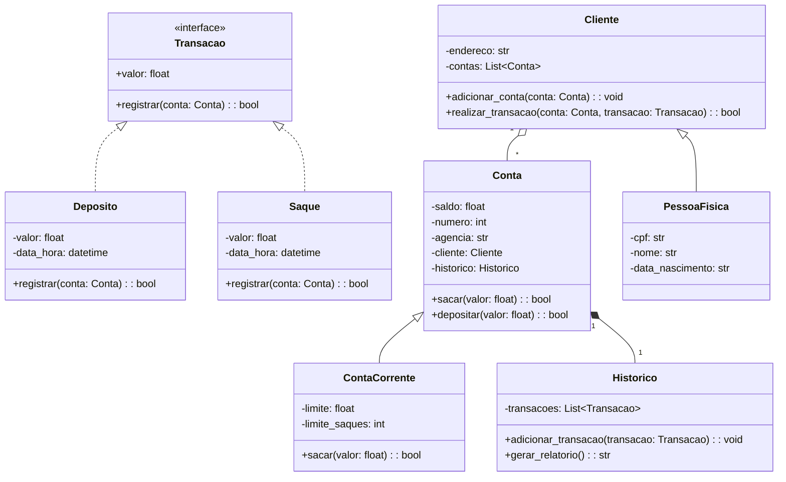

# 🏦 Sistema Bancário em Python (Procedural & POO)

[](https://www.python.org/)
[]()
[]()
[](https://dio.me)
[](LICENSE)

> Projeto de simulação de operações bancárias — depósito, saque, extrato, cadastro de clientes e contas — desenvolvido em duas abordagens: **procedural** e **orientada a objetos**. O objetivo é demonstrar evolução de lógica, modelagem de domínio, validações e testes em um contexto financeiro.

---

## 💼 Contexto de negócio

O sistema modela regras comuns de uma conta corrente, como limite por saque, quantidade máxima de saques e histórico de movimentações. Esse contexto permite demonstrar como requisitos financeiros podem ser convertidos em regras de software verificáveis.

---

## 🎯 Arquiteturas Implementadas

### 🔹 1. Versão Procedural (`sistema_bancario.py`)
Focada em lógica algorítmica essencial, tratamento defensivo de entrada do usuário com `try/except ValueError`, estruturas condicionais e controle de fluxo interativo via terminal.

### 🔹 2. Versão Orientada a Objetos (`sistema_bancario_poo.py`)
Implementa um modelo orientado a objetos com separação de responsabilidades:
- **Classes Abstratas & Polimorfismo:** `Transacao` (ABC) com implementações concretas `Deposito` e `Saque`.
- **Encapsulamento & Propriedades:** Proteção de dados sensíveis (`_saldo`, `_transacoes`, `_cliente`) através de `@property`.
- **Relacionamentos:**
  - `Cliente` (1) ── (N) `Conta`
  - `PessoaFisica` herda de `Cliente`
  - `ContaCorrente` herda de `Conta` com regras adicionais de limite por transação e teto de saques diários.
  - `Historico` desacoplado que audita cada transação com timestamp e tipo.

---

## 🔄 Diagrama de Classes (POO)



---

## ⚙️ Regras de Negócio e Validações

- **Depósito:** Requer montantes estritamente positivos (`> 0`).
- **Saque:** 
  1. Validação de saldo disponível em conta (não permite saldo negativo).
  2. Validação do limite financeiro por transação (padrão: `R$ 500,00`).
  3. Validação do teto máximo de saques diários (padrão: `3 saques/dia`).
- **Extrato Auditado:** Geração de extrato detalhado com tipagem de operação e saldo final consolidado.

---

## 🛠️ Visão para Suporte e Operações de TI

Este projeto ajuda a exercitar investigação de comportamentos incorretos em sistemas com regras claras.

### Exemplos de diagnóstico

- Saque recusado por saldo insuficiente
- Operação bloqueada por limite
- Quantidade máxima de saques atingida
- Dado inválido informado pelo usuário
- Divergência entre saldo e histórico

A abordagem é separar **regra de negócio**, **entrada do usuário** e **defeito do sistema** antes de classificar uma ocorrência.

## Como explicar em entrevista

> "Esse projeto me ajuda muito a explicar troubleshooting. Quando uma operação falha, eu não parto do princípio de que é erro do sistema. Primeiro verifico entrada, regra, estado da conta e histórico. Essa forma estruturada de investigar é exatamente o que quero aplicar em suporte e operações de TI."

---

## 🧪 Testes Automatizados

O projeto conta com suíte de testes unitários automatizados validando todas as regras críticas:

```bash
python -m unittest test_sistema_bancario.py
```

Cenários cobertos:
- ✅ Depósito com sucesso e atualização de saldo/histórico
- 🚫 Depósito de valores negativos ou zerados bloqueado
- ✅ Saque com sucesso deduzindo do saldo
- 🚫 Bloqueio de saque superior ao saldo disponível
- 🚫 Bloqueio de saque com valor acima do limite por operação
- 🚫 Bloqueio após atingir o limite diário de operações

---

## 🚀 Como Executar

### Pré-requisitos
- Python 3.10 ou superior.

### Executando a versão POO (Recomendada):
```bash
python sistema_bancario_poo.py
```

### Executando a versão Procedural:
```bash
python sistema_bancario.py
```

---

## 👨‍💻 Autor

Desenvolvido por **Daniel Fernando Martins**  
- **LinkedIn:** [linkedin.com/in/danielfernandomartins](https://www.linkedin.com/in/danielfernandomartins)  
- **GitHub:** [@danielfernandomartins](https://github.com/danielfernandomartins)  
- **Email:** [dfernandom@outlook.com](mailto:dfernandom@outlook.com)  

---

## 📄 Licença

Distribuído sob a licença **MIT**. Veja o arquivo [LICENSE](LICENSE) para detalhes.
